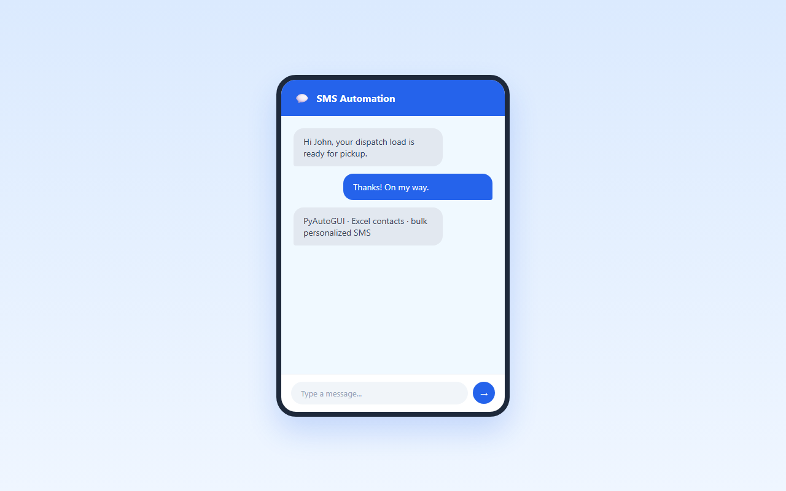

<div align="center">

# 🚀 Python Sms Automation

**A Python-based SMS automation tool using PyAutoGUI and Excel contact management for sending personalized bulk SMS messages automatically.**

Documented · MIT licensed · Maintained

[](https://www.python.org/)
[](LICENSE)
[](CONTRIBUTING.md)

</div>

---

## 🐍 Contribution graph

<picture>
  <source media="(prefers-color-scheme: dark)" srcset="https://raw.githubusercontent.com/mafzalkalwardev/python-sms-automation/output/snake-dark.svg" />
  <source media="(prefers-color-scheme: light)" srcset="https://raw.githubusercontent.com/mafzalkalwardev/python-sms-automation/output/snake.svg" />
  
</picture>

---

\# Python SMS Automation

A Python-based SMS automation tool built with PyAutoGUI and Excel integration for sending personalized SMS messages automatically.

The system reads phone numbers and names from an Excel file and sends customized SMS messages using desktop automation.

\## Screenshots

## Screenshots



## Features

\- Bulk SMS automation

\- Personalized SMS messages

\- Excel contact management

\- Automatic phone number formatting

\- Dynamic message templates

\- Progress tracking

\- Error handling

\- Cooldown management

\- Desktop automation using PyAutoGUI

\## Tech Stack

\- Python

\- Pandas

\- PyAutoGUI

\- OpenPyXL

\- Excel Automation

\## Project Structure

```text

python-sms-automation/

│

├── sms\_sender.py

├── phones.xlsx

├── README.md

└── .gitignore

```

\## Excel File Format

Your `phones.xlsx` file should contain:

| Phone | Name |

|------|------|

Example:

| Phone | Name |

|------|------|

| 1234567890 | John |

\## Installation

Install required packages:

```bash

pip install pandas openpyxl pyautogui

```

\## How to Run

```bash

python sms\_sender.py

```

\## Features Overview

\### Personalized SMS

Each message dynamically inserts the recipient name.

\### Excel Integration

Contacts are automatically loaded from Excel spreadsheets.

\### Cooldown System

Automatic delays between messages help reduce spam detection.

\### Error Handling

Invalid numbers and sending errors are safely handled.

\## Security Note

Do not upload private contact lists publicly.

\## Author

Muhammad Afzal Kalwar

GitHub:

@mafzalkalwardev
